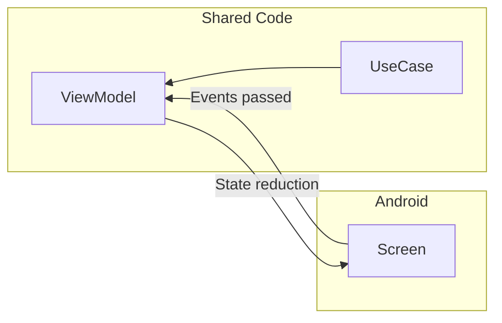
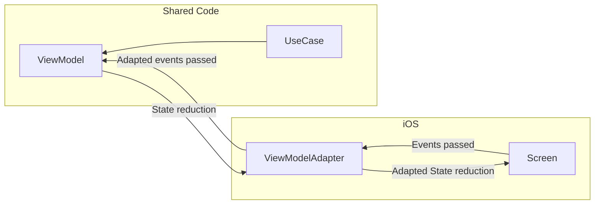

# mvvm-kmm
Simple MVVM for KMM

```mermaid
flowchart RL    
 subgraph  Android
 a[Screen]
 end  
 subgraph  Shared Code
c[UseCase]
b[ViewModel]
a --Events passed--> b
b --State reduction--> a
c --> b
 end
```

```mermaid
flowchart RL    
 subgraph  iOS
 a[Screen]
 b[ViewModelAdapter]
 end  
 subgraph  Shared Code
d[UseCase]
c[ViewModel]
a --Events passed--> b
b --Adapted State reduction--> a
b --Adapted events passed--> c
c --State reduction--> b
d --> c
 end
```